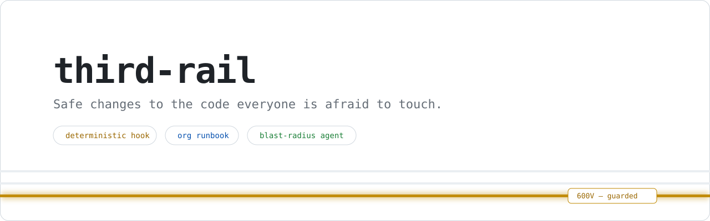
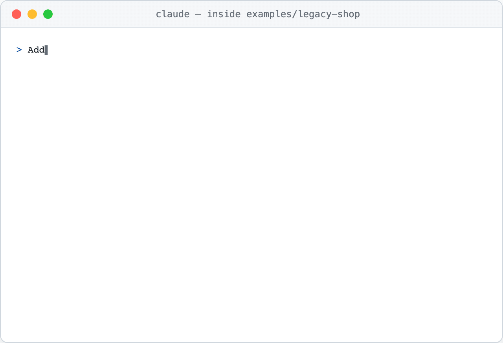
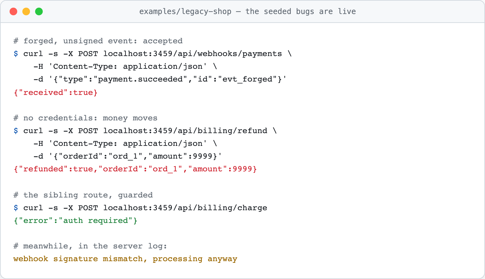
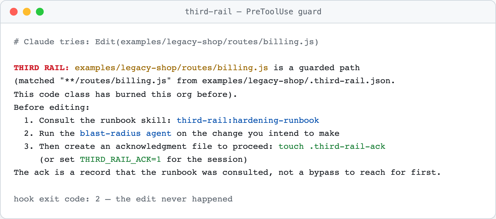
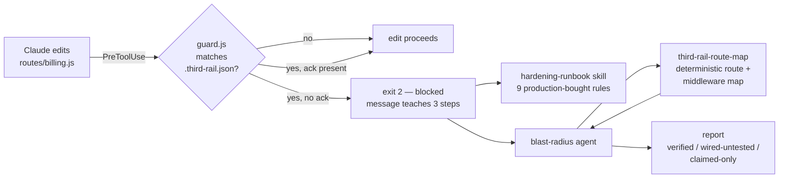
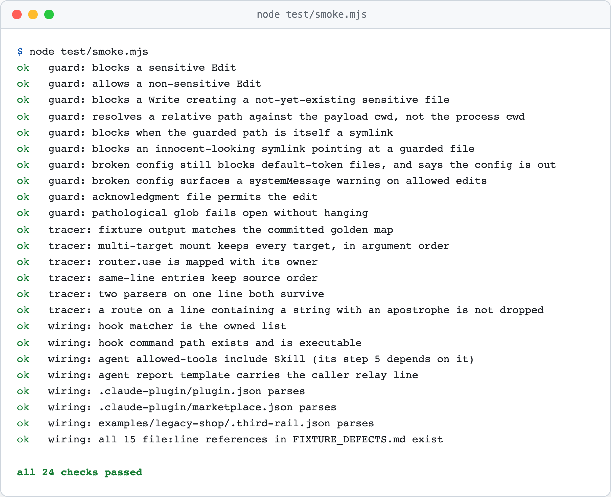

<picture>
  <source media="(prefers-color-scheme: dark)" srcset="assets/hero-dark.svg">
  
</picture>

<p>
  <a href="https://github.com/tmarcelojr/third-rail/blob/main/.claude-plugin/plugin.json"></a>
  <a href="LICENSE"></a>
  
  
</p>

A [Claude Code plugin](https://code.claude.com/docs/en/plugins) for the engineer whose next change touches a sensitive path — billing, webhooks, auth, sessions: the code where the people who wrote it are gone, test coverage is thin, and every change near money is a risk conversation.

<picture>
  <source media="(prefers-color-scheme: dark)" srcset="assets/demo-dark.gif">
  
</picture>

AI coding tools sharpen this problem in one specific way: they produce plausible changes fast, and plausible is the failure mode where wrong is expensive. third-rail turns your org's hardening knowledge into three components that fire at the right moments — a **deterministic guard hook** that blocks casual edits to sensitive paths before they happen, an **org runbook skill** with nine production-bought rules for payment, webhook, and auth code, and a **blast-radius agent** that maps what a change touches and reports every guard as verified, wired-but-untested, or claimed-only. The hook enforces, the skill knows, the agent judges.

It ships fully instantiated for one stack — the legacy Node/Express monolith — because one persona done properly beats four done shallowly. The guard and its config are stack-agnostic, and the shape ports to any workflow with a third rail: [docs/BUILD_YOUR_OWN_PLUGIN.md](docs/BUILD_YOUR_OWN_PLUGIN.md) is the fifteen-minute guide to rebuilding it around yours.

## Install

Prerequisites: [Claude Code](https://code.claude.com/docs) (tested with 2.1.241) and Node 18 or newer — the hook and tracer are dependency-free Node scripts. Then, inside Claude Code:

```text
/plugin marketplace add tmarcelojr/third-rail
/plugin install third-rail@third-rail
```

> [!IMPORTANT]
> If the install summary asks you to run `/reload-plugins`, do so — that arms the guard hook without restarting. Confirm with `/hooks` (lists the third-rail PreToolUse guard) and `/plugin list` (shows third-rail enabled).

<details>
<summary>Install from a clone instead</summary>

```bash
git clone https://github.com/tmarcelojr/third-rail.git
cd third-rail
```

Then inside Claude Code, add the clone as a local marketplace by path (use `./` or the absolute path; a bare `.` is not accepted):

```text
/plugin marketplace add ./
/plugin install third-rail@third-rail
```

`claude plugin validate .` passes clean from the repo root.

</details>

## Try it in five minutes

The repo bundles [`examples/legacy-shop`](examples/legacy-shop): a tiny Express monolith that boots, passes its own tests, and is seeded with six real production bug patterns. First, prove the bugs are live without the plugin:

```bash
cd examples/legacy-shop
npm install
npm start
```

```bash
curl -s -X POST localhost:3459/api/webhooks/payments \
  -H 'Content-Type: application/json' \
  -d '{"type":"payment.succeeded","id":"evt_forged"}'
```

<picture>
  <source media="(prefers-color-scheme: dark)" srcset="assets/live-bugs-dark.png">
  
</picture>

A forged, unsigned webhook is accepted. A refund with no credentials moves money. That is the monolith this plugin exists for. Now start `claude` in the fixture directory and:

1. **Ask for an innocent-sounding change** — *"Add a customer email notification to the refund endpoint in routes/billing.js"*. The guard blocks the edit before it happens: `billing.js` is a marked sensitive path, and the block message teaches the way forward instead of only refusing.

<picture>
  <source media="(prefers-color-scheme: dark)" srcset="assets/guard-block-dark.png">
  
</picture>

2. **Run the reviewer** — *"Use the blast-radius agent to review the billing and webhook paths of this app"*. Expect it to find, with `file:line`: the global `express.json()` destroying the webhook's raw body, the signature check that logs a mismatch and processes the event anyway behind an always-200, a correct constant-time verifier with passing tests and zero call sites, and the refund route missing the auth its siblings carry. Expect it to name `routes/auth.js` under "Adjacent, not reviewed" without wandering into it. A full report from a live run: [docs/BLAST_RADIUS_DEMO.md](docs/BLAST_RADIUS_DEMO.md) ([PDF](docs/BLAST_RADIUS_DEMO.pdf)).

3. **Acknowledge and fix** — `touch .third-rail-ack`, then let Claude apply the fix with the runbook loaded. The ack file is a recorded decision that the runbook was consulted, not a bypass.

> [!NOTE]
> The fixture is a demonstration with known answers, not a blind test. The defects were chosen to exercise the runbook, and the full answer key lives outside the fixture in [docs/FIXTURE_DEFECTS.md](docs/FIXTURE_DEFECTS.md) — nearly every defect with commands that confirm it without the plugin. One seeded bug deliberately maps to no runbook item, to separate a reviewer that matches a checklist from one that reads the code.

## How it works



Two decisions carry the design.

**Scripts compute; the model judges.** The guard and the route tracer are single-file Node stdlib scripts — no dependencies, readable start to finish ([guard.js](hooks/scripts/guard.js), [third-rail-route-map](bin/third-rail-route-map)). The tracer emits a JSON map of parsers, mounts, and routes in source order; the agent interprets that map instead of re-deriving the route table by prompt, because scripts do not hallucinate inventory. The tradeoff accepted: regex over AST. The tracer misses dynamic registration and computed paths, and it says so in a `limitations` field printed with every output. Enforcement is unaffected — the guard matches file paths and never parses code.

**"Done" means wired, and wiring is verified by executing, not reading.** The runbook's rule 2: a control counts as done only with a call site on the live path and a test that exercises it. The blast-radius report holds every guard to that bar — `verified`, `wired, untested`, or `claimed only` — because the most expensive bug class in legacy code is the fix that exists and does not run. The plugin applies the same rule to itself: it failed its own defined-but-not-wired test three review rounds in a row (a hook that validated but never fired, a config line that killed the install, a fix that collided with auto-loading — the full postmortems are in [docs/DECISIONS.md](docs/DECISIONS.md), D9–D11), so [test/smoke.mjs](test/smoke.mjs) now executes every boundary a script can reach: real hook payloads, both symlink directions, a deliberately broken config, a pathological glob, a golden route map, and wiring checks for every declared component.

```bash
node test/smoke.mjs
```

<picture>
  <source media="(prefers-color-scheme: dark)" srcset="assets/smoke-dark.png">
  
</picture>

The guard itself is built to be boring: it fails open on malformed input, junk config, and its own crashes — a guard bug must never brick the editor loop — and a config that exists but cannot be parsed is surfaced loudly rather than silently swapped for defaults. Blocks teach: the message names the matched rule and the exact three steps to proceed.

## Reference

<details>
<summary><strong><code>.third-rail.json</code> — marking your sensitive paths</strong></summary>

Place at the repo root (the guard also finds it from parent directories):

```json
{
  "sensitivePaths": [
    "**/routes/billing.js",
    "**/routes/webhooks.js",
    "**/middleware/auth.js"
  ]
}
```

| Behavior | Detail |
|---|---|
| Globs | `**` crosses directories, `*` stays within a segment; case-insensitive; matched against both the resolved path and its realpath, so symlinks in either direction cannot dodge the guard |
| No config | A conservative default list applies: whole-word tokens (`auth`, `billing`, `payment`, `webhook`, `stripe`, `checkout`, `refund`, `entitlement`, `session`, …) on code files only, so `authors-list.js` in an unrelated repo does not block |
| Empty `sensitivePaths` | An explicit decision — the guard stays out of the way |
| Broken config | Fails open, but the guard tells you your rules are not in effect (block message or a `systemMessage` warning) rather than silently reverting to defaults |
| Acknowledgment | `touch .third-rail-ack` next to the config (or the working directory), or `THIRD_RAIL_ACK=1` for the session. Scoped on purpose: a stray ack far up the tree cannot silently disable the guard |
| Pathological globs | Patterns with more than 10 wildcards fall back to substring matching so they cannot hang the hook |

</details>

<details>
<summary><strong>Hook contract</strong></summary>

The live matcher is owned by [hooks/hooks.json](hooks/hooks.json): `PreToolUse` on `Edit|Write|MultiEdit`, 10-second timeout, direct-executable command. The guard reads the tool payload from stdin, exits `0` to allow and `2` to block with the teaching message on stderr. Everything else about its behavior — path resolution against the payload `cwd`, symlink handling, fail-open rules — is exercised by `test/smoke.mjs`, which is the contract's executable form.

</details>

<details>
<summary><strong>Context cost — measured, not estimated</strong></summary>

Idle and on-invoke sizes from `claude plugin details third-rail`; run costs from live sessions.

| State | Cost |
|---|---|
| Idle (always loaded) | ~260 tokens: the skill and agent descriptions |
| Guard hook | 0 tokens idle; runs out of process. ~120 tokens of message only when it blocks |
| Skill triggered | ~2,000 tokens, loaded only when sensitive work starts |
| Agent invoked | The ~3,100-token definition is its size, not its cost. A live run burns tens of thousands of tokens inside the agent's own context; your conversation pays only for the returned report — measured ~1,900 tokens on a run with seven findings |

A first review on a guarded path takes three to five minutes end to end. The guard only fires on listed paths — a handful of files on most codebases — and the ack persists, so the first edit to billing today costs minutes and the next twenty cost nothing. If your team cannot accept any wait at edit time, the same review belongs in CI (roadmap, below).

</details>

<details>
<summary><strong>Supply chain</strong></summary>

Zero runtime dependencies: the hook and tracer are single-file Node stdlib scripts. No network installs, no postinstall scripts. The demo fixture depends on `express` only, installed by you, inside the fixture. The asset generator ([scripts/generate-readme-assets.mjs](scripts/generate-readme-assets.mjs)) uses Playwright and ffmpeg, dev-only and never shipped.

</details>

## Scope and limitations

Anthropic ships general-purpose `code-review` and `claude-security` plugins. third-rail is deliberately not that: it is the layer generic review cannot be — your org's runbook and your org's sensitive paths, enforced deterministically at edit time. The runbook that ships is one real org's starting point; edit [`skills/hardening-runbook/SKILL.md`](skills/hardening-runbook/SKILL.md) and `.third-rail.json` until they are yours. (The build-your-own guide from the intro also ships as a [print-ready PDF](docs/BUILD_YOUR_OWN_PLUGIN.pdf).)

Stated plainly:

- **The ack is an audit trail, not access control.** Claude itself can create the acknowledgment file. The guard is a speed bump that records a considered decision.
- **The guard watches the file-editing tools.** A shell command like `sed -i` through Bash is not intercepted. Measured multi-model testing showed shell-heavy models can route around the Edit-tool matcher while the runbook still carries the discipline; a blocking Bash heuristic was evaluated and deliberately scoped out (it would fire on innocent reads and miss interpolated writes). Fleet-grade, model-independent enforcement belongs in CI.
- **The tracer is static analysis** and prints its own blind spots. The agent treats its map as a starting inventory to verify with Read and Grep, and every report ends with what it could not verify statically — a review that hides its blind spots is worse than no review.

**Cut on purpose:** an MCP server (nothing here needs external system access), multi-framework support (one persona and one stack done properly beats four done shallowly), and auto-fix mode (on billing code, a reviewer that writes its own changes unreviewed is the disease pretending to be the cure).

**Roadmap:** runtime route introspection via Express's own route table after boot — static scan by default, runtime opt-in per repo, because a static scan can never hurt you and a runtime scan can. A real eval suite with measured trigger rates (three seed cases ship in [`evals/`](evals), runnable with `claude plugin eval .` where that early-access command is enabled). Headless blast-radius in CI commenting on PRs that touch sensitive paths. Org-wide distribution of the config and runbook through managed settings.

## Development

```bash
node test/smoke.mjs            # 24 checks: guard matrix, tracer golden map, wiring
claude plugin validate .       # manifest validation
```

The terminal screenshots and the demo GIF are reproducible from source — every frame renders real captured command output:

```bash
npm install --no-save --no-package-lock playwright
npx playwright install chromium
node scripts/generate-readme-assets.mjs
```

The decision log ([docs/DECISIONS.md](docs/DECISIONS.md)) records where the human overrode the tool during the build and why, including the three failures that shaped the test suite. Issues and PRs welcome; changes to guard or tracer behavior need a matching smoke check — that rule exists because of D9 through D11.

## License

[MIT](LICENSE)
